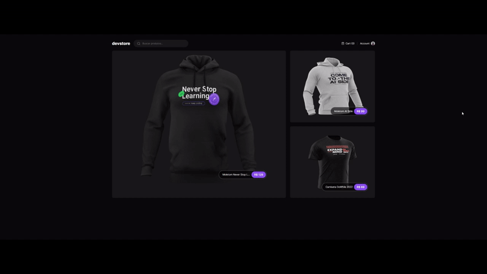

<h1 align="center">
  Dev Store
</h1>

<p align="center">
Este é um projeto de comércio eletrônico desenvolvido utilizando Next.js, uma poderosa estrutura de React para construir aplicativos web eficientes e escaláveis. O principal objetivo deste projeto é proporcionar uma experiência prática e de aprendizado na construção de uma aplicação de comércio eletrônico completa, focada em produtos como camisetas, moletons e canecas.
</p>

<p align="center">
  <a href="#como-executar">ℹ️ Como Executar?</a>&nbsp;&nbsp;&nbsp;|&nbsp;&nbsp;&nbsp;
  <a href="#web">💻 Web</a>&nbsp;&nbsp;&nbsp;|&nbsp;&nbsp;&nbsp;
  <a href="#tecnologias">🚀 Tecnologias</a>&nbsp;&nbsp;&nbsp;
</p>

---

# Como Executar?

> Clone o Repositório:

Node version 18.16.0

Clone

```bash
git clone https://github.com/JonatanPaes/devstore.git
```

Para executar o projeto utilizando Redux

```bash
cd devstore
```

Instale as dependências do projeto

```bash
pnpm install
```

# Web
Para executar o projeto

```sh
pnpm run dev
```

Para executar teste E2E
```sh
pnpm cypress run
```

<p align="center">
  
</p>


# Tecnologias
- [NextJS](https://nextjs.org/)
- [TailwindCSS](https://tailwindcss.com/)
- [TypeScript](https://github.com/microsoft/TypeScript)
- [Lucide](https://lucide.dev/)
- [Zod](https://zod.dev/)
- [Cypress](https://www.cypress.io/)
- [T3 Env](https://env.t3.gg/)
